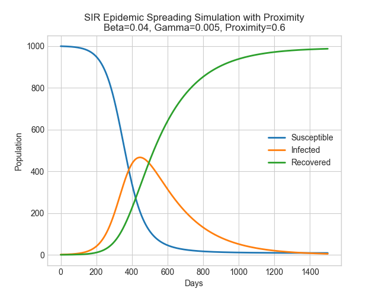
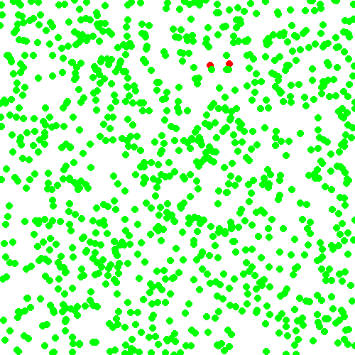

# Epidemic Spreading Simulation using SIR Model

This project simulates epidemic spreading using the SIR (Susceptible-Infectious-Recovered) model. The SIR model is a classic epidemiological model that divides a population into three compartments: susceptible, infected, and recovered individuals. The simulation demonstrates the progression of an epidemic over time and shows how different parameters, such as infection rate, recovery rate, and transmission radius, affect the spread of the disease.

## SIR Model Overview

The SIR model is a compartmental model used to understand the spread of infectious diseases within a population. The three compartments are defined as follows:

- **Susceptible (S)**: Individuals who are susceptible to infection.
- **Infected (I)**: Individuals who are currently infected and can transmit the disease to susceptible individuals.
- **Recovered (R)**: Individuals who have recovered from the infection and gained immunity.

## Files

The project consists of two Python files:

1. `graph.py`: This file contains a function to simulate the SIR model and plot the results on a graph using Matplotlib.

2. `simulation.py`: This file contains a function to simulate the SIR model in real-time using Pygame. The simulation visually represents the spread of the epidemic and generates a GIF animation capturing the progression.

## Requirements

The project requires the following libraries to be installed:

- Python 3.x
- NumPy
- Matplotlib
- Pygame
- Imageio

## Usage

1. Clone the repository to your local machine:

   ```
   git clone https://github.com/your-username/sir-model-simulation.git
   ```
2. Install requirements:

   ```
   cd sir-model-simulation
   pip install -r requirements.txt 
   ```

3. Run the simulation:

   ```
   python graph.py
   ```

   The `graph.py` file will simulate the SIR model and display the results in a Matplotlib graph. You can adjust the simulation parameters like `BETA`, `GAMMA`, `PROXIMITY`, `POPULATION`, `INITIAL_INFECTED`, and `DAYS` as needed.

   Note: The graph window will close automatically after viewing the simulation results.



4. Alternatively, run the live simulation:

   ```
   python simulation.py
   ```

   The `simulation.py` file will simulate the SIR model using Pygame and display a real-time animation of the epidemic spreading. The animation is saved as `sir_simulation.gif` in the same directory.

   You can adjust the simulation parameters like `BETA`, `GAMMA`, `PROXIMITY`, and `POPULATION` in the `simulation.py` file as needed.



## Customization

Feel free to customize the project according to your needs. You can modify the simulation parameters, add new features, or integrate the SIR model into other applications.

## License

This project is licensed under the [MIT License](LICENSE).

## Acknowledgments

- The SIR model and epidemic spreading simulation are based on classical epidemiological concepts.
- The Pygame visualization is inspired by real-time simulations in game development.
- Special thanks to the developers of NumPy, Matplotlib, Pygame, and Imageio for their excellent libraries.
